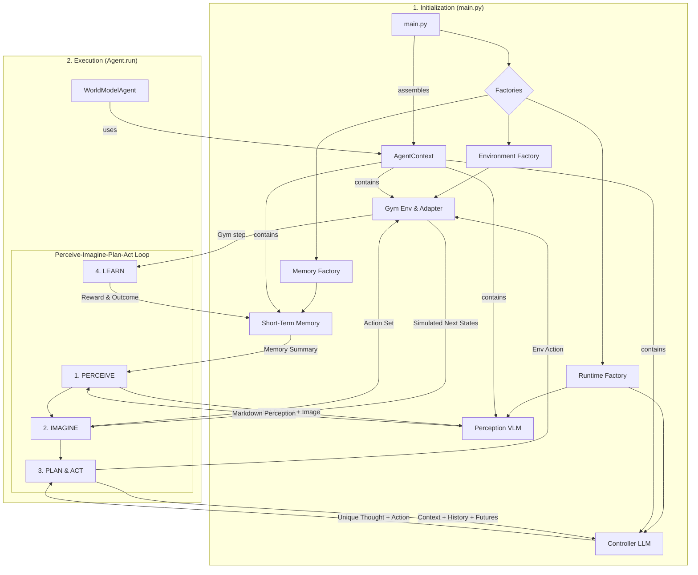

# SIMA2-Agent

A modular, multi-modal agent framework for Gymnasium environments, inspired by generalist agent architectures like Google's SIMA. This project provides a robust, extensible foundation for developing intelligent agents that can **Perceive, Imagine, Plan, and Act** in simulated worlds.

## Background and Purpose

The **SIMA2-Agent** (Scalable, Instructable, Multiworld Agent) is an experimental framework designed to bridge the gap between high-level language reasoning and low-level environment interaction. 

Unlike traditional Reinforcement Learning agents that rely on black-box policies, SIMA2-Agent implements a **World Model** approach. By utilizing Vision-Language Models (VLM) for perception and Large Language Models (LLM) for strategic planning, the agent can understand complex instructions, "imagine" the consequences of its actions before taking them, and articulate its reasoning process in natural language.

<table>
  <tr>
    <td></td>
    <td></td>
    <td></td>
  </tr>
</table>


## Key Features

-   **Perceive-Imagine-Plan-Act Cycle:** An explicit reasoning loop where the agent observes the scene, simulates potential outcomes, plans its strategy, and finally executes an action.
-   **Modular "World Model" Architecture:** Core components (Agents, Environments, Memory, Runtimes) are fully decoupled, allowing for easy experimentation with different models and logic.
-   **Deterministic Internal Simulator:** Uses a ground-truth simulator to provide the agent with perfect foresight of its immediate surroundings, enabling more effective long-term planning.
-   **Multi-Modal Intelligence:** Natively supports split-model runtimes, using a VLM for structured scene analysis and a separate LLM for high-level decision-making.
-   **Instruction-Driven:** Designed to follow natural language missions (e.g., "Navigate to the green square and stop").
-   **Robust Memory System:** A summarization-based memory that feeds the agent's history, thoughts, and outcomes back into its decision-making process.

## Architecture Flow Diagram

The architecture is centered around the `AgentContext`, a dependency container that assembles all modular components for the agent execution.



## Getting Started

### 1. Installation

This project uses `uv` for high-performance environment and package management.

```bash
# Navigate to the project root
cd SIMA2-Agent

# Create and activate a virtual environment
uv venv
source .venv/bin/activate  # On Windows: .venv\Scripts\activate

# Install dependencies
uv pip install -r gsima-agent/requirements.txt
```

### 2. Configuration

All configuration is managed in `gsima-agent/configs/`.

```bash
# Copy the example environment file
cp gsima-agent/configs/.env.example gsima-agent/configs/main.env
```

Open `main.env` and configure your models. Recommended models for [Ollama](https://ollama.com/):
- **Perception:** `llava:latest`
- **Controller:** `qwen2.5:3b` or `qwen3:0.6b` (for faster inference)

### 3. Running the Agent

Ensure your Ollama server is running (`ollama serve`).

```bash
# From the gsima-agent directory
cd gsima-agent
python -m gsima.main
```

Logs are stored in `outputs/logs/`, and video recordings of the agent's performance are saved to `outputs/recordings/`.

### 4. Running Tests

The test suite validates the modular architecture and agent logic without requiring live LLM calls.

```bash
# Run all tests from the project root
pytest gsima-agent/tests/
```
