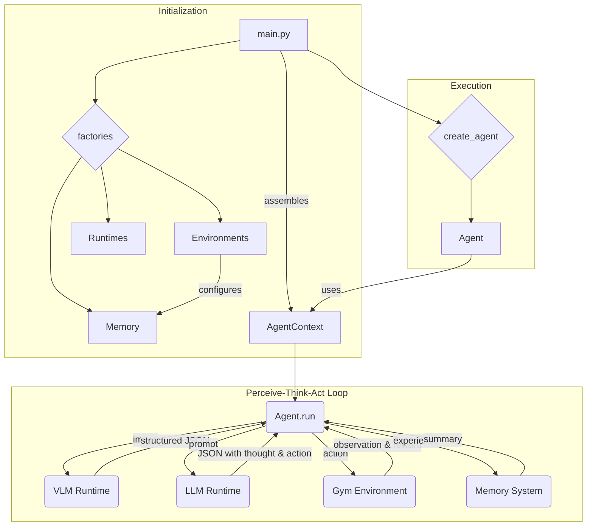

# SIMA2-Agent

A modular, multi-modal agent framework for Gymnasium environments, inspired by generalist agent architectures like Google's SIMA. This project provides a solid, extensible foundation for developing and experimenting with intelligent agents that can perceive, think, and act in various simulated worlds.

## Key Features

-   **Modular Architecture:** Core components (`Agents`, `Environments`, `Memory`, `Runtimes`) are fully decoupled and managed by factories, allowing for easy extension and swapping of implementations.
-   **Perceive-Think-Act Cycle:** The agent logic is built around an explicit reasoning loop. It first perceives the world (using a VLM), then generates an explicit "thought" about its strategy before finally selecting an action.
-   **Multi-Modal Intelligence:** Natively supports using a Vision-Language Model (VLM) for structured scene analysis and a separate Large-Language Model (LLM) for reasoning and decision-making.
-   **Extensible by Design:** Adding a new Gym environment or a new agent with a different reasoning architecture is a matter of creating a new module that adheres to the base abstract classes.
-   **Configurable:** All key parameters, including models, environment names, and run settings, are managed through a central `.env` file.

## Architecture Flow Diagram

The agent's architecture is designed around a clean orchestration of modular components. The `main.py` entry point assembles an `AgentContext` and passes it to the agent to run. The agent then enters the `Perceive-Think-Act` loop.



## Getting Started

### 1. Installation

This project uses `uv` for fast environment and package management.

```bash
# Navigate to the project root directory (SIMA2-Agent)
cd SIMA2-Agent

# Create a virtual environment
uv venv

# Activate the virtual environment
# On macOS/Linux:
source .venv/bin/activate
# On Windows:
# .venv\Scripts\activate

# Install the required dependencies
uv pip install -r gsima-agent/requirements.txt
```

### 2. Configuration

All configuration is handled in the `gsima-agent/configs/` directory.

```bash
# Navigate to the configs directory
cd gsima-agent/configs

# Copy the example .env file
cp .env.example main.env
```
Now, open `main.env` and edit the variables as needed. You will need to specify the `GYM_ENVIRONMENT` you want to run and the Ollama models (`OLLAMA_VLM_MODEL`, `OLLAMA_LLM_MODEL`) you have available.

### 3. Running the Agent

Ensure your Ollama server is running. Then, from the root `SIMA2-Agent` directory, run the main script:

```bash
python gsima-agent/gsima/main.py
```

Logs for the agent run will be stored in `gsima-agent/outputs/logs/`.

### 4. Running Tests

The test suite validates the modular architecture and agent logic.

```bash
# First, install the testing framework (if you haven't already)
uv pip install pytest

# Run the tests from the root SIMA2-Agent directory
uv run pytest gsima-agent/tests/
```