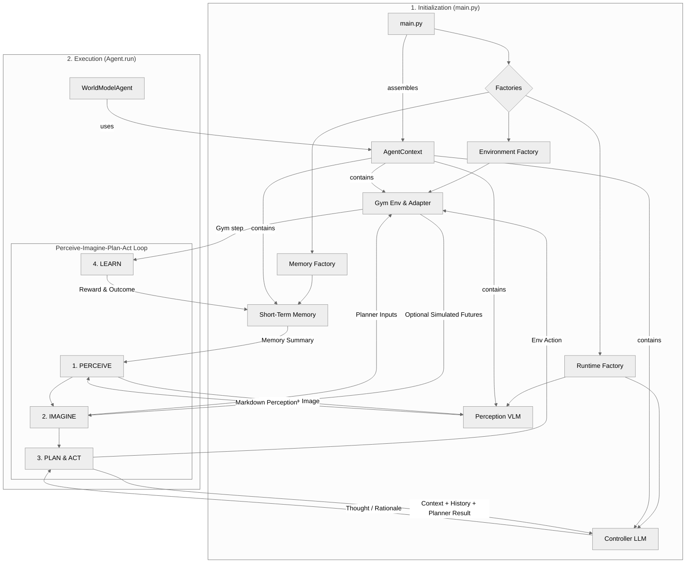

# SIMA2 Agent

SIMA2 Agent is a modular, multi-modal world-model framework for Gymnasium environments. The project is designed around a simple idea: let a VLM interpret the scene, let a controller reason over history and context, and let environment-specific adapters translate that reasoning into valid low-level actions.

The repository now includes support for multiple backend styles, with MiniGrid and ViZDoom examples wired through a common environment factory and adapter contract.

## Why this project exists

Most pure RL pipelines optimize a single policy end-to-end. SIMA2 Agent instead follows a more explicit loop:

- **Perceive** the current observation
- **Imagine** possible futures using environment capabilities
- **Plan** using memory and controller reasoning
- **Act** by executing a valid action through a backend adapter

This keeps the agent logic readable and makes it much easier to swap environments or runtimes.

## Highlights

- **Perceive → Imagine → Plan → Act** loop for structured decision-making
- **Environment factory** that infers backend type from Gym ID and loads the correct adapter
- **Adapter contract** so the world model stays generic across environments
- **Runtime abstraction** for VLM and LLM backends (including Ollama-based setups)
- **Memory summarization** to track recent transitions and outcomes
- **Support for multiple gym backends**, including MiniGrid and ViZDoom

## Example visual output

<table>
  <tr>
    <td></td>
    <td></td>
    <td></td>
  </tr>
</table>

## System Components and Flow Diagram

The architecture is centered around the `AgentContext`, a dependency container that assembles all modular components needed for the agent execution.


```mermaid
%%{init: {'theme': 'neutral'}}%%
graph TD
    subgraph "1. Initialization (main.py)"
        A[main.py] --> B{Factories}
        B --> C[Environment Factory]
        B --> D[Runtime Factory]
        B --> E[Memory Factory]

        C --> C1[Gym Env & Adapter]
        D --> D1[Perception VLM]
        D --> D2[Controller LLM]
        E --> E1[Short-Term Memory]

        A -- assembles --> F[AgentContext]
        F -- contains --> C1
        F -- contains --> D1
        F -- contains --> D2
        F -- contains --> E1
    end

    subgraph "2. Execution (Agent.run)"
        G[WorldModelAgent] -- uses --> F

        subgraph "Perceive-Imagine-Plan-Act Loop"
            H[1. PERCEIVE] -- VLM Prompt + Image --> D1
            D1 -- Markdown Perception --> H

            H --> I[2. IMAGINE]
            I -- Planner Inputs --> C1
            C1 -- Optional Simulated Futures --> I

            I --> J[3. PLAN & ACT]
            J -- Context + History + Planner Result --> D2
            D2 -- Thought / Rationale --> J

            J -- Env Action --> C1
            C1 -- Gym step --> K[4. LEARN]
            K -- Reward & Outcome --> E1
            E1 -- Memory Summary --> H
        end
    end
```

### How the flow works

1. **Initialization**: `main.py` builds the environment, runtime, and memory factories and packages them into `AgentContext`.
2. **Perception**: the VLM reads the current observation and converts it into semantic facts.
3. **Imagine**: the planner uses adapter capabilities to reason about possible future outcomes; if the environment supports simulation, those futures can be evaluated directly.
4. **Plan and Act**: the adapter may first provide an optional action override for domain-specific cases, otherwise the planner chooses the next action from the adapter-supported action set, and the controller runtime later provides a rationale/explanation for that choice.
5. **Learn**: the environment step result is stored in memory so the next iteration can benefit from recent experience.

### Why this structure matters

This layout keeps the responsibilities clear:

- the **agent** controls the loop
- the **adapter** handles environment-specific translation and simulation rules
- the **runtime** handles perception and controller model calls
- the **memory** stores recent transitions and summaries

## Design principles

### 1. Generic world model, backend-specific adapters

The core agent logic should not need to know whether the environment is MiniGrid, ViZDoom, or another Gym backend. Instead:

- the world model asks the adapter for capabilities
- the adapter translates actions for that environment
- the adapter can optionally provide environment-specific heuristics without coupling the main loop

This is one of the major improvements in the current codebase.

### 2. Explicit capability checks

Adapters expose metadata and capability signals such as:

- whether deterministic simulation is available
- whether a stop action is meaningful
- whether a goal-distance signal exists
- how actions should be translated to environment-native values

### 3. Prompt-driven perception and controller reasoning

The runtime layer is intentionally separated from the environment-specific logic. The agent can swap prompt templates and model runtimes without rewriting the control loop.

## Supported environment pattern

The current repository is structured so that adding a new Gym environment mainly means:

1. defining a backend package under the environment namespace
2. registering the environment ID correctly
3. implementing an adapter that conforms to the adapter contract
4. optionally adding prompt/schema helpers for that backend

This keeps the system much closer to the intended “plug-in environment” model.

## Repository layout

- `gsima-agent/gsima/agents/` — agent loop and planning logic
- `gsima-agent/gsima/environments/` — environment factory, adapters, and backend-specific helpers
- `gsima-agent/gsima/runtime/` — runtime integrations for models
- `gsima-agent/gsima/memory/` — memory implementations
- `gsima-agent/gsima/utils/` — config and utility helpers
- `gsima-agent/tests/` — regression tests for the architecture and factory logic

## Getting started

### 1. Install dependencies

This project uses `uv` for environment management, but standard Python tooling also works.

```bash
cd SIMA2-Agent
uv venv
source .venv/bin/activate
uv pip install -r gsima-agent/requirements.txt
```

### 2. Configure the runtime and environment

All runtime settings are managed under `gsima-agent/configs/`.

```bash
cp gsima-agent/configs/.env.example gsima-agent/configs/main.env
```

Update `main.env` so that:

- `GYM_ENVIRONMENT` points to the target environment ID
- `ENV_TYPE` matches the backend family when needed
- your VLM / LLM endpoints are configured correctly

Recommended Ollama setup:

- **Perception:** `llava:latest`
- **Controller:** `qwen2.5:3b` or `qwen3:0.6b`

### 3. Run the agent

Make sure your model runtime is available (for example, `ollama serve` if you are using Ollama).

```bash
cd gsima-agent
python -m gsima.main
```

Logs are written to `outputs/logs/`, and recordings are stored under `outputs/recordings/`.

## Running tests

The test suite verifies the factory behavior, adapter contract, and agent logic without requiring live model calls.

```bash
pytest gsima-agent/tests/
```

## Notes on current development status

The project is now moving toward a cleaner separation between:

- generic agent reasoning
- environment-specific adapters
- runtime-specific model wrappers

That separation is what makes the framework easier to extend as more Gym environments are added over time.
