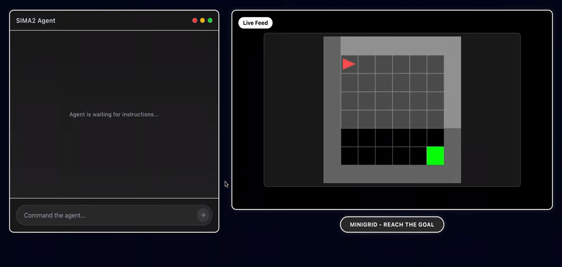
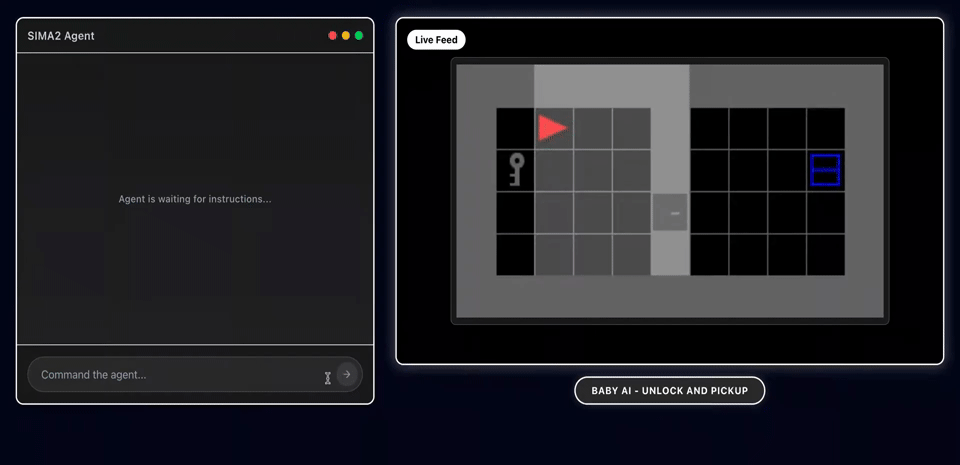
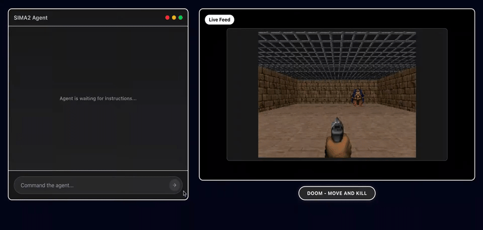
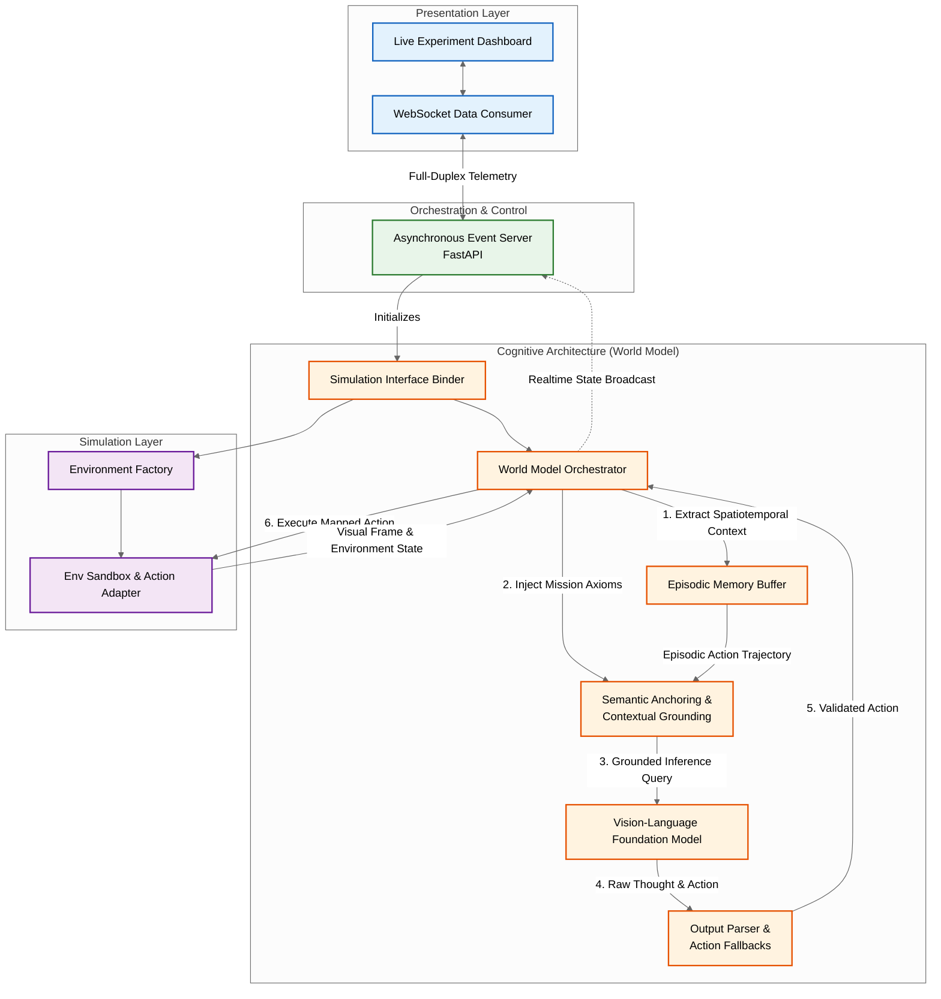

# GSIMA: Grounded Semantic Instructable Multiworld Agent

**GSIMA** is an experimental research framework dedicated to building generalist, multi-modal world-model agents. Inspired by Google DeepMind's SIMA architecture, GSIMA explores the frontier of zero-shot embodied AI by completely decoupling the agent from traditional Reinforcement Learning (RL) reward paradigms and internal game-engine state vectors.

At its core, GSIMA implements a strict, reward-blind **Perceive-Think-Act** cognitive loop powered by a multimodal foundation model. Our **GSIMA Agent** constructs a localized "world model" to navigate spatial constraints, predict temporal dynamics, and execute strategic actions across fundamentally distinct simulation topologies—from 2D discrete grid-worlds to 3D continuous first-person shooters. 

Crucially, GSIMA forces explicit causal reasoning through **Semantic Anchoring**, ensuring every executed action is mathematically linked to a visually grounded perception and a strategic rationale.

---

## Core Research Concepts

While traditional Reinforcement Learning optimizes narrow policies bound to explicit environment variables, the GSIMA agent investigates a generalized, zero-shot approach to embodied intelligence. Our primary research areas include:

1. **Generalist World Modeling:** The agent synthesizes environmental states entirely from visual and linguistic context. It builds a localized understanding of the world without accessing internal game-engine coordinates or underlying object logic.
2. **Reward-Blind Autonomous Execution:** GSIMA completely discards numerical reward signals. The cognitive engine is driven entirely by semantic reasoning, leveraging a dynamic memory buffer to maintain episodic context and prevent behavioral looping.
3. **Unified Multimodal Inference:** The architecture consolidates perception, spatial rationale, and decision-making into a singular vision-language query. This eliminates the need for fragmented sub-networks for vision processing and action selection, standardizing the intelligence pipeline.

## Technical Highlights

- **Asynchronous Cognitive Engine:** The core `WorldModelAgent` operates in a non-blocking, multi-threaded event loop. It orchestrates perception extraction, LLM querying, and environment stepping while streaming real-time telemetry out via an event emitter.
- **Agnostic Environment Adapter Pattern:** The architecture abstracts away engine-specific complexities (like Gym wrappers and observation spaces) through a polymorphic adapter interface. This allows the agent to transparently interact with 2D discrete grids (BabyAI/MiniGrid) and 3D continuous engines (ViZDoom) using a unified action schema.
- **Realtime Observability Dashboard:** A high-performance React (Vite) frontend consumes full-duplex WebSocket streams to render the agent's live cognitive cycle. The dashboard visualizes the active game frame alongside the agent's structured thoughts, semantic narratives, and actions in real-time.
- **Dynamic Episodic Memory System:** GSIMA utilizes a rolling memory buffer to inject the recent history of action-thought pairs directly into the prompt context window. This temporal awareness prevents the agent from falling into repetitive behavioral loops.
- **Robust Output Parsers & Fallbacks:** The engine features strict Markdown output parsers equipped with aggressive regex sanitization and intelligent action fallbacks, guaranteeing stable execution even when the VLM outputs non-deterministic or malformed syntax.
- **Automated Execution Tracing:** The framework automatically captures agent gameplay and features a centralized FFmpeg pipeline (`video_work`) to compress, speed-adjust, and export execution traces into optimized GIFs and MP4s for research documentation.

## Experimental Environments

GSIMA currently supports and evaluates on three primary testbeds:<table width="100%">
  <thead>
    <tr>
      <th width="15%">Environment Module</th>
      <th width="55%">SIMA2 Experiment Agent Behavior</th>
      <th width="30%">Challenge</th>
    </tr>
  </thead>
  <tbody>
    <tr>
      <td><b>MiniGrid (Empty)</b><br/>2D top-down grid world</td>
      <td></td>
      <td><b>Game Complexity:</b> Ego-centric viewport with limited visibility and no access to global coordinate maps.<br/><br/><b>Cognitive Intelligence:</b> Demands robust spatial mapping. The VLM must persistently construct a localized world model to orient itself and track its heading toward unseen objectives.</td>
    </tr>
    <tr>
      <td><b>BabyAI (Unlock & Pickup)</b><br/>2D top-down grid world</td>
      <td></td>
      <td><b>Game Complexity:</b> Procedurally generated layouts with interactable objects requiring sequential state changes (e.g., inventory management).<br/><br/><b>Cognitive Intelligence:</b> Requires complex causal logic and compositional reasoning. The agent must visually ground language (e.g., color-matching) and deduce multi-stage dependencies entirely from its world model.</td>
    </tr>
    <tr>
      <td><b>ViZDoom (Basic)</b><br/>3D first-person shooter</td>
      <td></td>
      <td><b>Game Complexity:</b> Real-time 3D environment with visually noisy, low-resolution textures and required angular precision.<br/><br/><b>Cognitive Intelligence:</b> Tests spatial depth perception. The agent must construct a depth-aware mental model from a flat 2D RGB array and calculate horizontal angular offsets to execute precise hitscan targeting.</td>
    </tr>
    <tr>
      <td><b>ViZDoom (Predict)</b><br/>3D first-person shooter</td>
      <td></td>
      <td><b>Game Complexity:</b> High-stakes temporal dynamics with moving targets and slow-traveling projectiles that require spatial leading.<br/><br/><b>Cognitive Intelligence:</b> Introduces physics prediction. The cognitive engine must estimate velocity vectors, calculate projectile travel times, and execute proactive suppression fire, overriding static alignment heuristics.</td>
    </tr>
  </tbody>
</table>

<br/>

---

## System Architecture

The architecture is built on a strict separation of concerns, decoupling the Presentation Layer, the Orchestration API, and the Cognitive Agent Engine.


```mermaid
%%{init: {'theme': 'neutral'}}%%
graph TD
    %% Styling
    classDef ui fill:#e3f2fd,stroke:#1565c0,stroke-width:2px;
    classDef api fill:#e8f5e9,stroke:#2e7d32,stroke-width:2px;
    classDef core fill:#fff3e0,stroke:#e65100,stroke-width:2px;
    classDef env fill:#f3e5f5,stroke:#6a1b9a,stroke-width:2px;

    subgraph "Presentation Layer"
        UI[Live Experiment Dashboard<br/>]:::ui
        WS_CLIENT[WebSocket Data Consumer]:::ui
        UI <--> WS_CLIENT
    end

    subgraph "Orchestration & Control"
        API[Asynchronous Event Server<br/>FastAPI]:::api
        WS_CLIENT <-->|Full-Duplex Telemetry| API
    end

    subgraph "Cognitive Architecture (World Model)"
        AC[Simulation Interface Binder]:::core
        PTA[World Model Orchestrator]:::core
        PROMPT[Semantic Anchoring &<br/>Contextual Grounding]:::core
        MEM[Episodic Memory Buffer]:::core
        VLM[Vision-Language Foundation Model]:::core
        PARSER[Output Parser &<br/>Action Fallbacks]:::core
        
        API -->|Initializes| AC
        AC --> PTA
        PTA -- "1. Extract Spatiotemporal Context" --> MEM
        PTA -- "2. Inject Mission Axioms" --> PROMPT
        MEM -- "Episodic Action Trajectory" --> PROMPT
        PROMPT -- "3. Grounded Inference Query" --> VLM
        VLM -- "4. Raw Thought & Action" --> PARSER
        PARSER -- "5. Validated Action" --> PTA
    end

    subgraph "Simulation Layer"
        EF[Environment Factory]:::env
        ENV[Env Sandbox & Action Adapter]:::env
        
        AC --> EF
        EF --> ENV
        PTA -- "6. Execute Mapped Action" --> ENV
        ENV -- "Visual Frame & Environment State" --> PTA
    end

    %% Event Stream back to API
    PTA -. "Realtime State Broadcast" .-> API
```

### Cognitive Data Flow

1. **Orchestration**: The user initializes a simulation trial via the Live Dashboard. The API constructs the Simulation Interface Binder, dynamically injecting the selected Environment Adapter, Episodic Memory Buffer, and VLM Runtime based on the configuration.
2. **Perception & Grounding**: The simulation yields a raw visual frame. The Cognitive Engine retrieves the agent's recent episodic trajectory from the memory buffer and injects environment-specific rules (axioms) via the Prompt Injector to provide critical contextual grounding.
3. **Reasoning (Semantic Anchoring)**: The multimodal query is dispatched to the Vision-Language Model. By enforcing rigorous semantic grounding, the agent constructs a localized world model to analyze the visual state, deduce strategic rationale, and synthesize a confident narrative alongside its final semantic intent.
4. **Validation & Fallback**: The Output Parser aggressively sanitizes the VLM's generated response, stripping hallucinations or invalid formatting. If an invalid action is predicted, the system safely defaults to a fallback heuristic (e.g., `STOP`) to ensure continuous, crash-free execution.
5. **Execution**: The Environment Adapter translates the validated canonical action (e.g., `TURN_LEFT`) into the underlying engine's discrete integer map. The action is executed in the Sandbox, and the resulting visual frame and telemetry are streamed back over WebSockets for real-time UI rendering.

---

## Getting Started

### Prerequisites
- **Python 3.10+** (for the World Model & Backend)
- **Node.js 18+** (for the React Dashboard)
- **uv** (Fast Python package installer)

### 1. Engine & Backend Setup

Navigate to the core agent directory and initialize the virtual environment:

```bash
cd gsima-agent
uv venv
source .venv/bin/activate
uv pip install -r requirements.txt
```

### 2. Environment Configuration

All runtime constraints and API keys are managed centrally in the `configs/` directory.

```bash
cp configs/.env.example configs/main.env
```

Open `configs/main.env` and define the following crucial variables:
- `GEMINI_API_KEY`: Your valid Google AI Studio key.
- `GYM_ENVIRONMENT`: Target scenario ID (e.g., `VizdoomPredictPosition-v1` or `BabyAI-UnlockPickup-v0`).
- `ENV_TYPE`: The namespace mapping (e.g., `vizdoom_predict`).

### 3. Launching the Orchestration Server

Boot the asynchronous FastAPI backend (ensure your virtual environment is active):

```bash
uvicorn gsima.api.server:app --reload
```

### 4. Launching the Experiment Dashboard

In a new terminal process, boot the React visualization suite:

```bash
cd gsima-agent/gsima-ui
npm install
npm run dev
```

Navigate to `http://localhost:5173` to observe the agent's multimodal reasoning cycle in real-time.